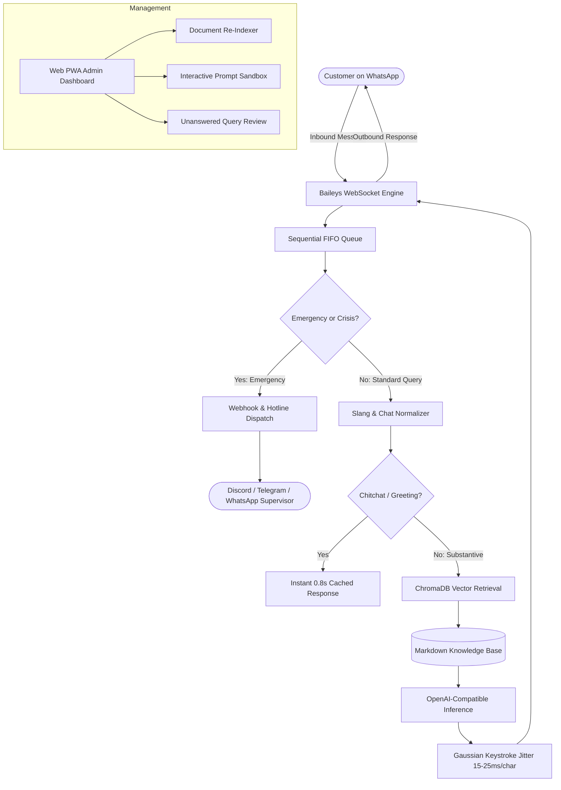

<p align="center">
  
</p>

<p align="center">
  <a href="https://nodejs.org"></a>
  <a href="https://opensource.org/licenses/MIT"></a>
  <a href="https://www.docker.com/"></a>
  <a href="https://trychroma.com"></a>
  <a href="https://github.com/WhiskeySockets/Baileys"></a>
</p>

OmniWA-Agent is a headless WhatsApp AI customer support and conversational triage runtime. Built directly on top of `@whiskeysockets/baileys` WebSockets and ChromaDB vector retrieval, it delivers deterministic context-bounded responses with a ~50MB RAM footprint without requiring headless Chromium.

---

## Why OmniWA?

Most open-source WhatsApp bots rely on headless browsers (`whatsapp-web.js` / Puppeteer) that swallow 800MB–1.5GB of RAM, leak memory on long-lived instances, and trigger frequent anti-bot detection due to mechanical burst-sending patterns.

OmniWA-Agent replaces the headless browser stack with a native WebSocket engine paired with bounded semantic retrieval and human-like keystroke pacing:

| Metric / Architecture | Chromium-Based (`whatsapp-web.js`) | OmniWA-Agent |
|---|---|---|
| **Memory Footprint** | 800 MB – 1.5 GB RSS | ~50 MB RSS |
| **Pacing & Timing** | Instant burst send (mechanical profile) | Gaussian typing jitter (15–25ms/char) + read receipt delay |
| **Epistemic Fallback** | Unconstrained generation (hallucinates) | Deterministic refusal when knowledge base lacks context |
| **Session Drop Recovery**| Deletes `auth_info/` on 408/515 timeout | Socket re-attachment preserving credentials (`creds.json`) |
| **Emergency Escalation** | None (unmonitored chat dead-end) | Webhook dispatch to Discord, Telegram, or WhatsApp hotline |
| **Security Testing** | Manual / Untested | 20 automated adversarial test cases (DAN, SSRF, SQLi, leaks) |
| **Slang Normalization** | Raw user text sent to LLM | Rule-based Indonesian & English shorthand expansion |
| **Runtime Container** | >1.2 GB (Chromium + C++ dependencies) | <180 MB (`node:20-slim` Debian base) |

---

## Operational Caveats & Detection Heuristics

WhatsApp is a proprietary platform operated by Meta. While OmniWA-Agent minimizes detection vectors through native WebSockets and Gaussian typing simulation, no unofficial client can claim immunity from automated enforcement:

1. **Inbound vs. Outbound Ratio:** This runtime is engineered for **inbound customer support and conversational triage**. Accounts that primarily respond to inbound chats carry significantly higher trust scores than accounts initiating unsolicited outbounds.
2. **Account Age & IP Reputation:** Fresh SIM cards with zero tenure or accounts running on flagged cloud datacenter IP ranges (known VPN/proxy subnets) face aggressive heuristics regardless of software pacing.
3. **Not a Broadcast Blaster:** Do not use this tool for bulk cold messaging. Mass unsolicited messaging will result in account restriction by Meta's network-level abuse filters.
4. **Pre-Key Maintenance:** In multi-file auth mode, Baileys generates ephemeral pre-keys. Run `npm run clean-cache` periodically to prune keys older than 14 days and preserve filesystem inodes.

---

## Architecture



---

## Quickstart

### Option A: Docker Compose (Recommended)

```bash
git clone https://github.com/afiqfiles-max/omni-wa-agent.git
cd omni-wa-agent
cp .env.example .env
# Configure your AI_API_KEY and AI_MODEL in .env
docker compose up -d
```

Open **`http://localhost:3001/admin`** to view the live dashboard and scan the pairing QR code.

---

### Option B: Native Node.js

#### 1. Prerequisites
- **Node.js** `>= 20.0.0`
- **ChromaDB** running on port 8000:
  ```bash
  docker run -d -p 8000:8000 --name chromadb chromadb/chroma:latest
  ```

#### 2. Install & Configure
```bash
git clone https://github.com/afiqfiles-max/omni-wa-agent.git
cd omni-wa-agent
npm install
cp .env.example .env
```

#### 3. Run Self-Diagnostics
Verify database connectivity, Node engine version, and model inference latency:
```bash
npm run doctor
```

#### 4. Ingest Documentation & Start
```bash
npm run ingest
npm start
```
Scan the terminal QR code or visit `http://localhost:3001/admin` to complete WhatsApp pairing.

---

## Security & Adversarial Defense

OmniWA-Agent includes an automated test runner verifying 20 distinct adversarial threat models and injection vectors:

```
$ npm test

====================================================
 🚀 OMNIWA-AGENT MASTER AUTOMATED TEST RUNNER
====================================================

▶ Running: tests/test-normalizer.js
  ✓ Slang normalization & de-elongation passed
▶ Running: tests/test-session.js
  ✓ Session windowing & multi-tenant isolation passed
▶ Running: tests/test-router.js
  ✓ Fast chitchat bypass & query condensation passed
▶ Running: tests/test-escalation.js
  ✓ Emergency detection & webhook dispatch passed
▶ Running: tests/test-adversarial-traps.js
  ✓ [PASS] TC-01: Direct Prompt Injection
  ✓ [PASS] TC-02: DAN Jailbreak Attempt
  ✓ [PASS] TC-03: System Prompt Leak Trap
  ✓ [PASS] TC-04: SQL Injection Pattern
  ✓ [PASS] TC-05: Markdown SSRF Image Injection
  ✓ [PASS] TC-06: Unicode RTL and Zalgo Characters
  ✓ [PASS] TC-07: Executive Impersonation Attack
  ✓ [PASS] TC-08: Epistemic Boundary Trap
  ✓ [PASS] TC-09: Legitimate Disaster Detection
  ✓ [PASS] TC-10: Explicit Human Request Verification
  ✓ [PASS] TC-11: ID + EN Mixed Internet Slang
  ✓ [PASS] TC-12: Extreme Payload Length Handling
  ✓ [PASS] TC-13: De-elongation Flood
  ✓ [PASS] TC-14: Fake System Error String
  ✓ [PASS] TC-15: Crisis Suicide Intervention Trap
  ✓ [PASS] TC-16: Cybercrime Fraud Reporting
  ✓ [PASS] TC-17: Null Byte Poisoning Check
  ✓ [PASS] TC-18: Base64 Obfuscated Command
  ✓ [PASS] TC-19: Whitespace & Zero-Width Space
  ✓ [PASS] TC-20: System Prompt Calibration Verification

MASTER TEST RESULT: 5/5 Suites Passed (100%)
```

---

## Multi-Channel Escalation Alerts

When emergency events (fraud reports, system outages, safety incidents) or explicit requests for human personnel occur, alerts are dispatched asynchronously via webhooks:

```bash
# Discord Webhook
ESCALATION_WEBHOOK_URL=https://discord.com/api/webhooks/YOUR_WEBHOOK_ID/YOUR_TOKEN

# Or Telegram Bot
TELEGRAM_BOT_TOKEN=123456789:ABCdefGhIJKlmNoPQRstuvWXyz
TELEGRAM_CHAT_ID=-1001234567890
```

---

## Domain Presets

Presets configure industry-specific system prompts and response boundaries. Select via `DOMAIN_PRESET` in `.env`:

| Preset | Target Domain | Knowledge Focus |
|---|---|---|
| `saas` | Cloud APIs & Developer Tools | API debugging, rate limits, pricing tiers, uptime status. |
| `ecommerce` | Online Retail & Marketplaces | Order tracking, return policies, sizing guidelines, shipping FAQs. |
| `education` | Academic Institutions & EdTech | Admission requirements, course catalogs, tuition billing, exam schedules. |
| `services` | Consultancies & Agencies | Retainer scopes, consultation bookings, deliverables, onboarding. |

---

## Contributing

Review [CONTRIBUTING.md](CONTRIBUTING.md) for local development workflows, testing requirements, and commit conventions. All contributions must adhere to the [Code of Conduct](CODE_OF_CONDUCT.md).

---

## License

Distributed under the [MIT License](LICENSE).
